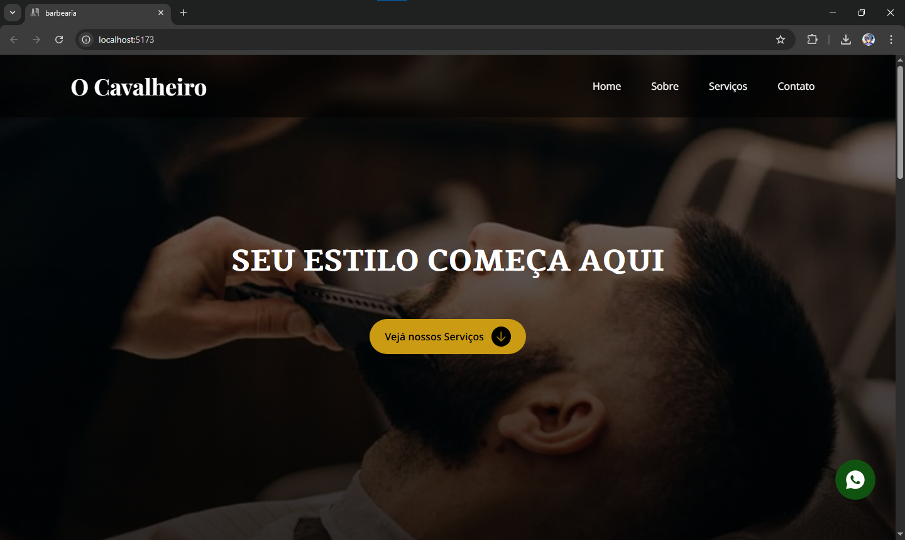

# Barbearia - Projeto React v2

### V1
Projeto front-end desenvolvido com React de um site de barbearia, o objetivo foi criar um site no qual os clientes podem ver os serviços e entrar em contato por qualqueer meio de contato.

### V2
Ná verção 2 foram adicionados varios ajustes para melhor imerção no site como: menu mobile, hovers, botão fixo do whatsApp, animações, ajustes de tamanhos, melhoria na responsividade e fontes mais tematicas.

---

## Objetivo

Desenvolver um site para ver serviços e entrar em contato, foco em UX (Experiencia do Usuário), utilizando um estilo premium e feito em Mobile first.

---

## Tecnologias

* React
* CSS Modules
* JavaScript
* Mobile first

---

## Estrutura do Projeto

* **Home** 

    * Header
    * Hero Section
    * About
    * Services
    * Contact
    * Footer

---

## Conceito de designer

O designer foi inspirado em:

    * Estilo premium
    * Site Dark

Esse site foi criado em objetivo de transformar em um site proficional futuramente.

---

## Autor

Desenvolvido por **Ernand Soares**
